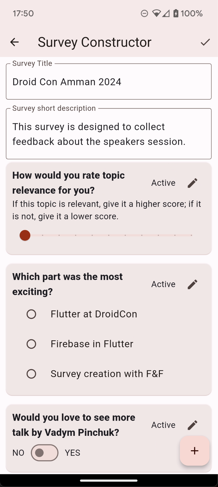
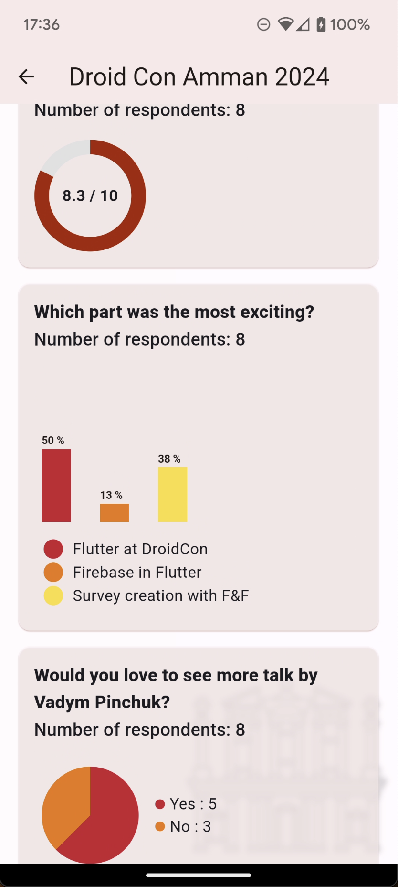
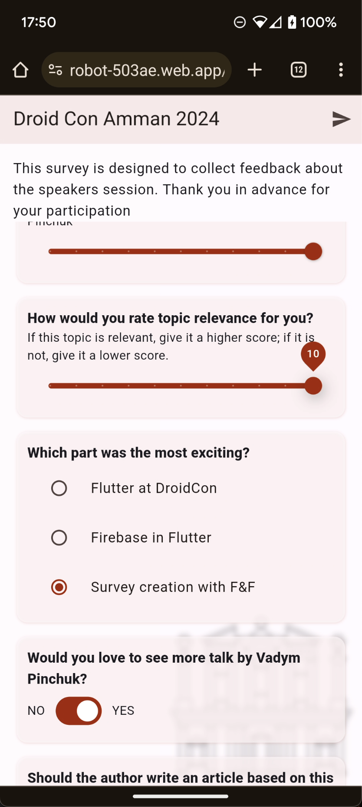
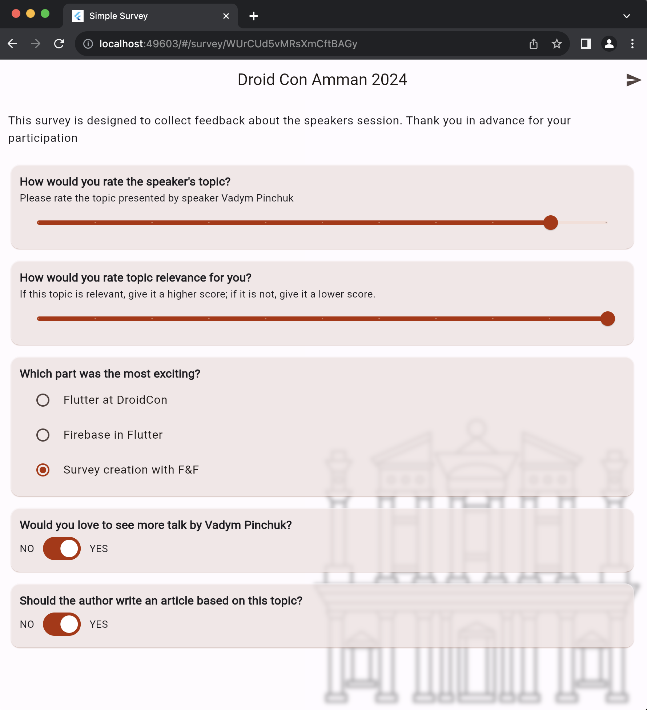
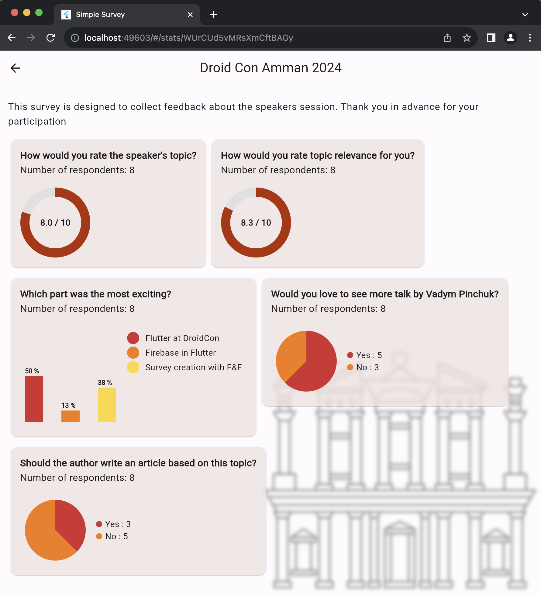

# Simple Survey

This project started as a simple draft to enable the collection of students' votes.
After careful consideration, the author decided to make it scalable and configurable.
The goal is to use this Survey Platform to create surveys for the conferences the author speaks at
and collect feedback about the sessions because "Feedback is a gift."

## Getting Started

This project is designed to work on both mobile devices and the web.
It uses the Flutter framework and Firebase for hosting and Cloud Firestore.

While it is public, Firebase configurations are not pushed to the repository.
To make it work, please follow this guide on how to enable Firebase for a Flutter project:
[Firebase Setup Guide](https://firebase.google.com/docs/flutter/setup?platform=android)

## Mobile Version

The author created this project to be mobile-first, but for taking a survey, installing the
application makes no sense.
Therefore, the survey part is web-based.

Mobile routes include:

- List of created surveys
- Survey Constructor / Editor
- Survey Stats screen
- Taking a survey via a mobile web browser

| Survey Constructor                        | Survey Stats                         | Take a Survey - Web                 |
|-------------------------------------------|--------------------------------------|-------------------------------------|
|  |  |  |

## Web Version

The web application is hosted on Firebase hosting, making it easy to use for taking surveys.
While it's primarily intended for survey-taking, it can also be used for everything mentioned
earlier in the mobile version.

| Survey                            | Stats                           | 
|-----------------------------------|---------------------------------|
|  |  |

